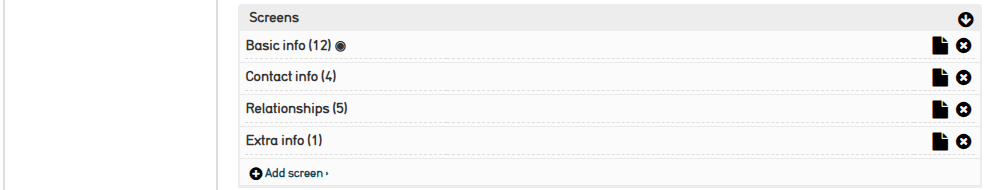
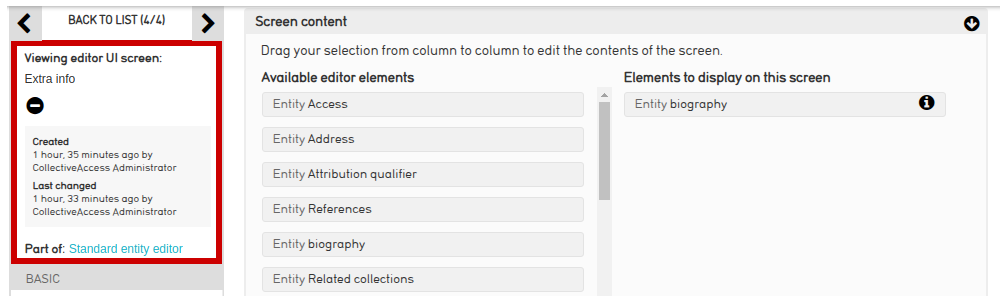
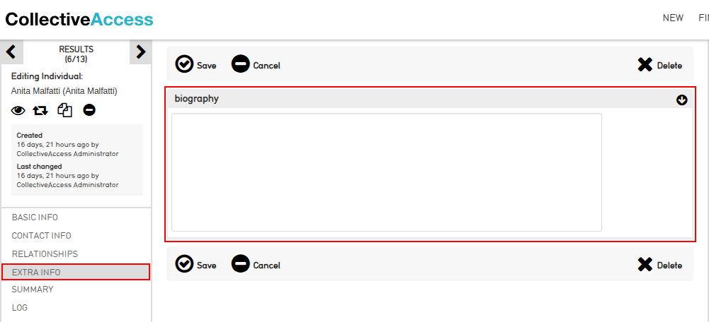

# Gemini - CollectiveAccess

Gemini is a plugin developed for CollectivaAccess (that is an open-source software platform designed for 
managing and presenting collections of various types, including museum artifacts, archival materials, and library materials. 
It's particularly suitable for large and complex collections that require sophisticated cataloging and search capabilities).

This plugin automates the creation of concise data using Gemini (large language model developed by Google AI. 
It's designed to be more advanced than previous models, capable of understanding and responding to complex queries), 
which are then integrated into CollectiveAccess's database. 

Firstly, Gemini contains a modulo that allows to generate artist's biography. 

# Requirenents on CollectiveAccess (providence)

  - Go to menu **manage > administration**.
    

  - Select a **METADATA ELEMENTS** and blick on right side buttion **New**.
      
  - Create a metadata element with the below information (**biography**), 
    
    
    add the following restriction (this restriction garantes that the metadata biography is atributed only to **individuals** entities). And, save it. 
      

  - Go to menu **manage > administration > USER INTERFACES** and select to edit **Standard entity editor** (click no icon edit).
    

  - Create a new screen **Extra info** (the name is not important!).    
    

  - Enter to this new screen config. And, in the section "screen content", move the metadata element **biography** (initially positioned in the left side) to the rigth side.
    And save it.
    

  - Now, we can see in the editing individuals the screen **Extra info** with the **biography** field.
    

# Requirenents on Pawtucket 
  - Edit the file "[Pawtucket's path]/themes/default/views/Details/ca_entities_default_html.php". And, add the following code:
    ```html
    {}
    ```
    See below:
    

# Installation

  - This folder can be copied to path of [CollectiveAccess' path]/app/plugins or the below code can be executed:
    ```
    git clone https://github.com/reynaldocv/Geminip-CollectiveAccess.git
    ```
> [!IMPORTANT]
> Once done, it is needed to rename the folder to "gemini". 
  
  - Now, you need to generate a APIKEY from google applications (https://ai.google.dev/gemini-api/docs) and copied to file [CollectiveAccess' path]/app/plugins/gemini/Gemini.conf.

    ```
    APIKEY = "copied_here_your_api_key_to_use_Gemini" 
    ```
## Tutorial

<p align="center">
         
</p>

## Tela de Criação de um novo usuário

<p align="center">
         
</p>

<p align="center">
         
</p>

## Tela de Eventos por Categorias

<p align="center">
         
</p>

## Tela de Lista de Eventos como Postagens

<p align="center">
         
</p>


## Tela de Lista de Eventos num Map

<p align="center">
         
</p>


## Tela de Chat (para estabelecer um encontro)

<p align="center">
         
</p>

